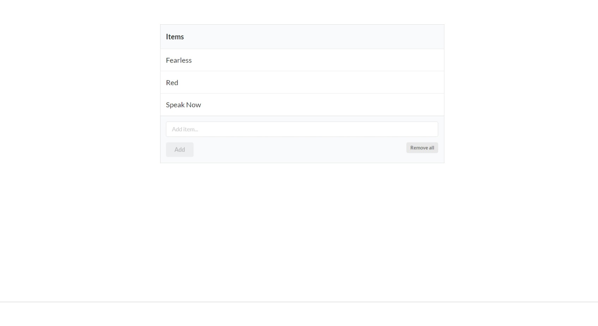
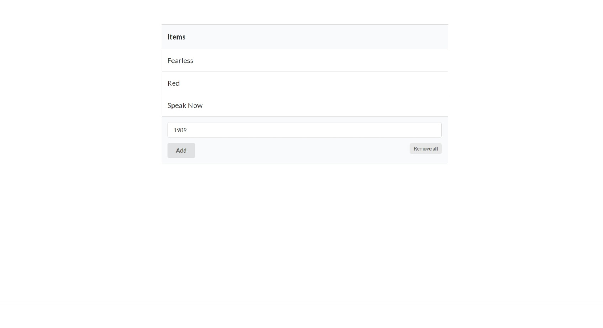
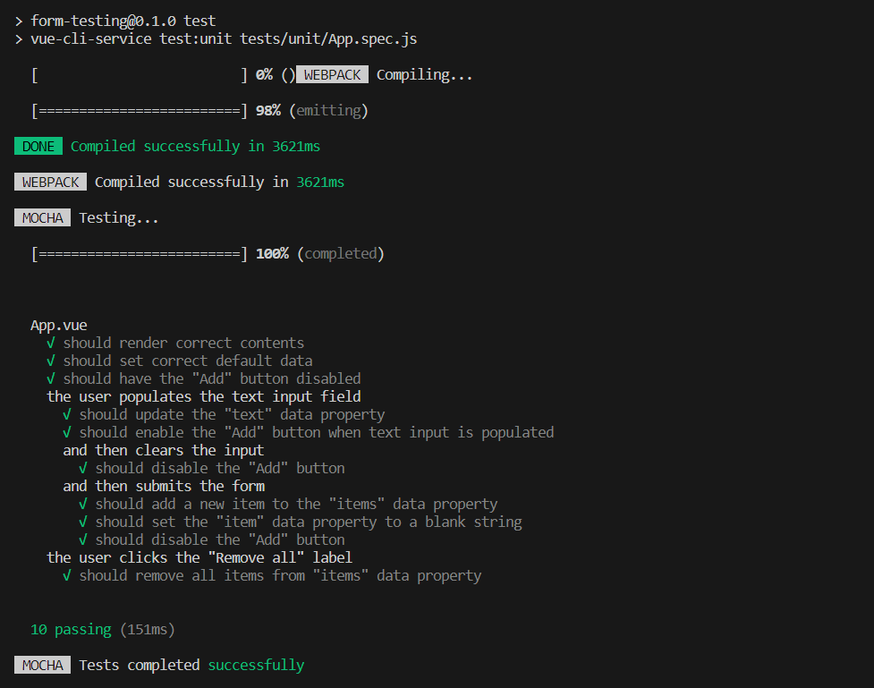

<a name="readme-top"></a>
<!-- TABLE OF CONTENTS -->
<details>
  <summary>Table of Contents</summary>
  <ol>
    <li>
      <a href="#about-the-project">About The Project</a>
      <ul>
        <li><a href="#built-with">Built With</a></li>
      </ul>
    </li>
    <li>
      <a href="#getting-started">Getting Started</a>
      <ul>
        <li><a href="#prerequisites">Prerequisites</a></li>
        <li><a href="#installation">Installation</a></li>
        <li><a href="#project-setup">Project Setup</a></li>
      </ul>
    </li>
    <li><a href="#key-features">Key Features</a></li>
    <li><a href="#usage">Usage</a></li>
    <li><a href="#contact">Contact</a></li>
  </ol>
</details>

# About The Project
A basic form app to understand how units tests can be made in Vue, using <code>vue-test-utils</code>, ***Mocha*** and ***Chai***

## Built With
* [![HTML5][HTML5-shield]][HTML5-url]
* [![CSS3][CSS3-shield]][CSS3-url]
* [![JavaScript][JavaScript-shield]][JavaScript-url]
* [![Vue.js][Vue.js-shield]][Vue.js-url]
* [![Semantic-UI][Semantic-UI-shield]][Semantic-UI-url]
* [![Mocha][Mocha-shield]][Mocha-url]
* [![Chai][Chai-shield]][Chai-url]

<p align="right">(<a href="#readme-top">back to top</a>)</p>

# Getting Started

## Prerequisites
Before cloning and using this application, you'll need to install these things on your computer:
* [Node.js](https://nodejs.org/en/download/): a single-threaded, open-source, cross-platform runtime environment for building fast and scalable server-side and networking applications. It runs on Chrome's V8 JavaScript runtime engine, and it uses event-driven, non-blocking I/O architecture, which makes it efficient and suitable for real-time applications.
* [npm](https://docs.npmjs.com/about-npm): the default package manager for the JavaScript runtime environment Node.js. It consists of a command line client, also called npm, and an online database of public and paid-for private packages, called the npm registry. The registry is accessed via the client, and the available packages can be browsed and searched via the npm website.
* [Vue](https://vuejs.org/): a JavaScript framework for building user interfaces. It builds on top of standard HTML, CSS, and JavaScript and provides a declarative and component-based programming model that helps you efficiently develop user interfaces, be they simple or complex.
* [Visual Studio Code](https://code.visualstudio.com/download): You can choose any IDE or Text Editor that you want. To build a simple application like this, I recommend <b>Visual Studio Code</b>.

## Installation
You can install this application by cloning this repository into your current working directory:
```sh
git clone https://github.com/theEmperorofDaiViet/form-testing.git
```
After cloning the repository, you can open the project by Visual Studio Code.

## Project Setup
```
npm install
```

### Adds unit-mocha plugin for vue-cli
```
vue add unit-mocha
```

### Compiles and hot-reloads for development
```
npm run serve
```

### Compiles and minifies for production
```
npm run build
```

### Lints and fixes files
```
npm run lint
```

### Runs the test
```
npm run test
```

### Runs the tests in watch mode
```
npm run test:watch
```

### Customize configuration
See [Configuration Reference](https://cli.vuejs.org/config/).

<p align="right">(<a href="#readme-top">back to top</a>)</p>

# Key Features
- The template is a `<div>` element that contains a HTML table with the following details:
    - The table has a title of ‘**Items**’ specified in the header (`<thead>`).
    - The body of the table, `<tbody>`, displays a list of items from an items array stored in the components data, with the help of the <code>v-for</code> directive.
    - The footer consists of a form that upon submit calls an <code>addItem()</code> method to add items to the list:
        - An input field that is bound to an <code>item</code> data property
        - An <kbd>Add</kbd> button is used to submit the form
        - A <kbd>Remove all</kbd> label invokes a <code>removeAllItems()</code> method on click to remove all items from the list.

+ Testing App:
    + Test whether the components <kbd>Add</kbd> button is <code>disabled</code> upon page load
    + Test initial data
    + Test if the component renders the correct template content
    + Test if the <code>item</code> data property matches the input value after the event is triggered
    + Test whether the <kbd>Add</kbd> button to become disabled again when the user clears an input field that has been filled out
    + When a user submits the form, test:
        + If the newly added item is in the data property <code>items</code> and is displayed in the rendered table
        + If the <code>item</code> data value is reverted to a blank string and the input field is cleared out
        + If the <kbd>Add</kbd> button is disabled once again
    + Test whether no items remain in the form after a user clicks the <kbd>Remove all</kbd> label

<p align="right">(<a href="#readme-top">back to top</a>)</p>

# Usage
Our app looks like this:

<p align="center">
    
    
</p>

Run the tests:

<p align="center">
    
</p>

<p align="right">(<a href="#readme-top">back to top</a>)</p>

# Contact
You can contact me via:
* [![GitHub][GitHub-shield]][GitHub-url]
* [![LinkedIn][LinkedIn-shield]][LinkedIn-url]
* ![Gmail][Gmail-shield]:&nbsp;<i>Khiet.To.05012001@gmail.com</i>
* [![Facebook][Facebook-shield]][Facebook-url]
* [![Twitter][Twitter-shield]][Twitter-url]

<br/>
<p align="right">(<a href="#readme-top">back to top</a>)</p>

<!-- MARKDOWN LINKS & IMAGES -->
<!-- Tech stack -->
[HTML5-shield]: https://img.shields.io/badge/html5-%23E34F26.svg?style=for-the-badge&logo=html5&logoColor=white
[HTML5-url]: https://www.w3.org/html/
[CSS3-shield]: https://img.shields.io/badge/css3-%231572B6.svg?style=for-the-badge&logo=css3&logoColor=white
[CSS3-url]: https://www.w3.org/Style/CSS/
[JavaScript-shield]: https://img.shields.io/badge/JavaScript-323330?style=for-the-badge&logo=javascript&logoColor=F7DF1E
[JavaScript-url]: https://www.ecma-international.org/
[Vue.js-shield]: https://img.shields.io/badge/vuejs-%2335495e.svg?style=for-the-badge&logo=vuedotjs&logoColor=%234FC08D
[Vue.js-url]: https://vuejs.org/
[Semantic-UI-shield]: https://img.shields.io/badge/Semantic%20UI%20React-35BDB2.svg?style=for-the-badge&logo=Semantic-UI-React&logoColor=white
[Semantic-UI-url]: https://semantic-ui.com/
[Mocha-shield]: https://img.shields.io/badge/Mocha-8D6748?style=for-the-badge&logo=Mocha&logoColor=white
[Mocha-url]: https://mochajs.org/
[Chai-shield]: https://img.shields.io/badge/chai-A30701?style=for-the-badge&logo=chai&logoColor=white
[Chai-url]: https://www.chaijs.com/

<!-- Contact -->
[GitHub-shield]: https://img.shields.io/badge/github-%23121011.svg?style=for-the-badge&logo=github&logoColor=white
[GitHub-url]: https://github.com/theEmperorofDaiViet
[LinkedIn-shield]: https://img.shields.io/badge/linkedin-%230077B5.svg?style=for-the-badge&logo=linkedin&logoColor=white
[LinkedIn-url]: https://www.linkedin.com/in/khiet-to/
[Gmail-shield]: https://img.shields.io/badge/Gmail-D14836?style=for-the-badge&logo=gmail&logoColor=white
[Facebook-shield]: https://img.shields.io/badge/Facebook-%231877F2.svg?style=for-the-badge&logo=Facebook&logoColor=white
[Facebook-url]: https://www.facebook.com/Khiet.To.Official/
[Twitter-shield]: https://img.shields.io/badge/Twitter-%231DA1F2.svg?style=for-the-badge&logo=Twitter&logoColor=white
[Twitter-url]: https://twitter.com/KhietTo